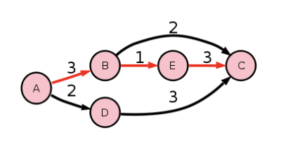
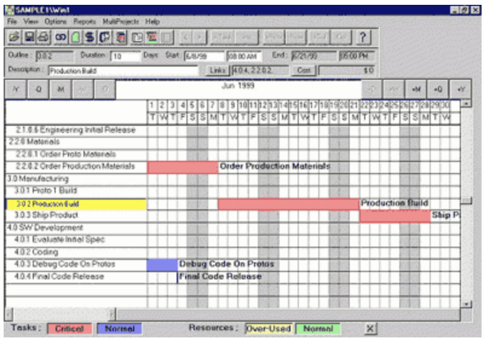
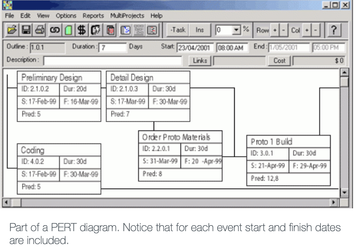
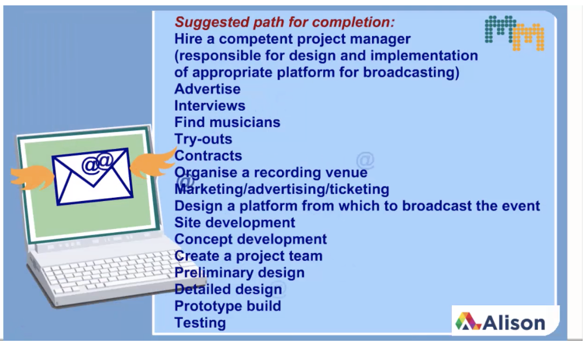
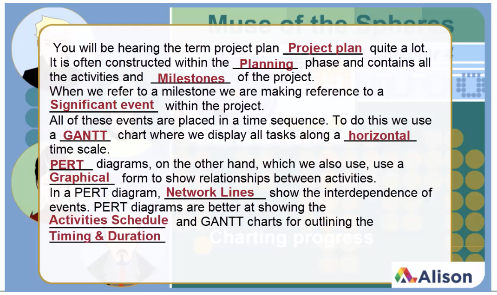
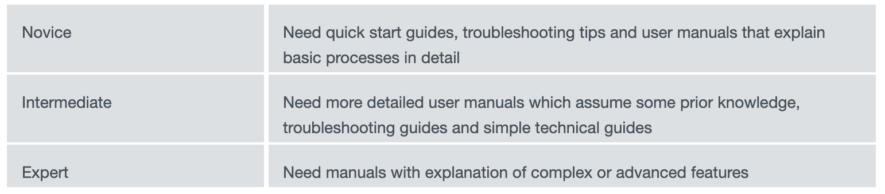
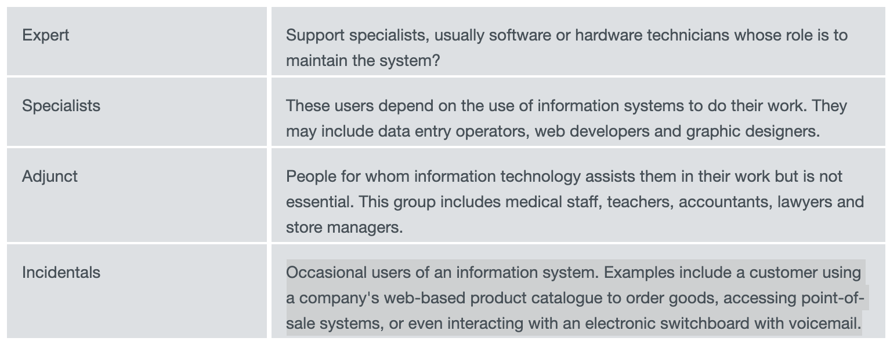

# Module 1 - Learning Outcomes

## Goals of Module
  - Describe the four stages of a project.
  - List the key tools used in a typical IT project.
  - Explain the function of a Gantt chart.
  - Identify the five main elements of a PERT diagram and what purpose they serve.
  - Illustrate how a Critical Path is developed.
  - Discuss the impact of failing to plan a project.

---
## Project Management Includes
  - Organizing people, resources, and procedures
  - Accomplishing a project within a set timeline and budget
  - When starting think about
    - Purpose and aim of project
    - Your resources available
    - Costs, human constraints, and time
    - The tasks and procedures to complete the project

### Tools
Used for documenting and tracking the progress of a project
  - GANTT Charts
  - Critical Path Method (CPM)
  - Program Evaluation and Review Technique (PERT)

---
## PM Methodology
### Phases
  1. Investigation
  2. Planning and Design 
  3. Production
  4. Monitoring and Evaluation

### Phase 1 - Investigation
  - Involves:
    - The initial commissioning of the project
    - The identification of the initial aim and goals
    - Studying the possible ways the project could be completed
  - Is undertaken by top level management or strategic planners

### Phase 2 - Planning & Design 
#### Important because
  - Provides foundation for the project
  - Ensures objectives can be met within the budget and timeline
#### Involves
  - Defining the
    - Purpose of the project
    - Objectives to be achieved

  - Breaking the project into tasks or activities
    - Defining the purpose of each one

  - Estimating the time required for each activity
    - shortest and longest possible 

  - Identifying milestones and key time markers
    - keeps the project on schedule

  - Determining the sequence of activities and any constraints affecting the sequence. 
    - Critical Path!
    - For example, some tasks must be completed before other ones can start, or particular resources might be required for the activity. 

    - This also includes:
      - Deciding which activities should be completed before others can commence
      - Identifying activities that can be done simultaneously or must be done at the same time
      - Assigning resources, people, materials and equipment to activities
      - Estimating the cost of resources
      - Drawing up a calendar of events

#### Tools for Planning & Design 
  - A project plan for management review
  - A GANTT chart
  - A PERT diagram, including a critical path, or a network diagra

### Phase 3 - Production 
#### Involves
  - Providing the resources
  - Completing the activities
  - Monitoring, controlling and recording the progress of the project on the GANTT chart
  - Comparing the current progress to the planned schedule
  - Updating and refining the schedule as required
  - Monitoring resource use to ensure no budgetary blowout
  - Ensuring milestones and overall goals are met

### Phase 4 - Monitoring and Evaluation
- Once the project is transferred to the client the project team is 'decommissioned'
- Management will assess the success of a project
  - How effecient and effective was everything?
#### Success Assessment
  - Quality
    - How well it has met the objectives? 
    - What is the final quality of the product?
  - Cost
    - Did the project stay within the budget specified and proposed use of resources?
  - Time
    - Did the project finish on or before the specified date? 
    - Was it the shortest possible time for the project?
  - Timeliness
    - Was the project completed in time for the information to be of use?
  - Accuracy
    - Are there any errors in the product?
  - Relevance
    - Does the project/product include only those elements required by the client?
  - Completeness
    - Does the client have everything they need in order to do their work and make their decisions?

---
## Lesson 5 - Case Study
### Interview Tips
  - Show your understanding of the position
  - Highlight your pertinent skills

---
## Lesson 6 - PM Tools
  - PM Tools are generally used for:
    1. Estimating Activity Time
        - Based off of experience or 
    2. Scheduling and Expediting 
        - If there are delays they should identify alternate actions to bring the project back within the time constraints. 
          - This is done by putting more resources, time or money into a particular activity. 
        - Assessing time and costs need to be traded off in order to get the project completed.
        - Expediting the schedule involves identifying tasks that could possibly be reduced in time if enough money or resources were available.
    3. Critical Path Method
      
        - A series of activities which are vital to the event being completed on time
        - A delay in one event will delay the completion of the project.

### GANTT Charts
  
  - Displays tasks and costs along a horizontal time scale
  - Each tasks is recorded accoring to it's start and end date
  - Shows the best possible way to complete a project in the shortest time
  - Activities can be sequential or in parallel
  - Note
    - Does not show critical path
    - Does not show relationships between tasks

### PERT Diagrams
  

  - Show relationships between activities and time frames
  - Better at identifying the relationship between tasks rather than the progress of tasks over time.

  - Key Elements in PERT Diagrams
    1. Activities
        - list of activities in the project and their dependencies
    2. Nodes/Events
        - indicating the beginning or end of an activity
    3. Network lines 
        - show the interdependence of events
    4. Critical path
        - the sequence of dependent events that have the sum of longest duration
    5. Slack time
        - events not on the critical path usually have slack time
        -  extra time for that event that does not effect the timing of other events thus not effecting the project time. That means that can fall behind schedule and there is no impact on the project completion date.

---
## Lesson 7 - PM Tools Case Study
### Noteworthy
  - PM created GANTT chart to outline all stages
  - Handed out PERT diagrams to his team
    - Enabled communication with the team
    - Keeps team on track
  - Uses of GANTT Chart
    - List out tasks
    - Break down project into objectives
    - Timeline to keep track of costs and resources
    - Ability to efficiently track time
    - Ability to see which tasks can overlap
      - also which tasks are dependent on one another
    - Use info to prioritize tasks
    - All information in one place

### Review of Tools
#### GANTT Charts
  - Displays tasks along a horizontal scale
  - Record the time for each task by indicating start and finish dates
  - Shows the best way to complete tasks in the shortest possible time
  - Shows how activities can be done in parallel and sequentially

#### PERT Diagrams (Network Diagrams)
  - Uses graphical forms to show relationships between activities and time frames
  - Show actual tasks and the point at which these activities begin or end
  - List activities in the project and their dependencies
  - Show the interdependence of events
  - Indicate the critical path and slack time
  - Often provide the 3 estimates for the project duration:
    - Pessimistic, Optimistic, and most-likely

#### CPM Diagram (Critical Path Method)
  - A network diagram showing only one time estimate

---
## Lesson 8 - GANTT Chart Case Study
### Noteworthy
  - Before starting have a suggested path for completion:
  
  - Then you put this information into a GANTT chart
  - Example of explaining the role to a PC:
  

---
## Lesson 9 - PM Documentation
Documentation is important!
### Documentation should
  - Provide an overview of the system capabilities and it's software
  - Include specific procedures
  - Provide training or reference material

### Importance
  - No docs prevents systems from meeting it's full potential 
  - Without docs, users may fail and the full potential of the system will never be realized

### Types of Documentation
1. Program Docs
    - When developing a software solution
    - The developer or programmer will document all steps of the process
    - The software product should be fully supported with technical documentation
    - Any programmer in the future can understand the process and the code that was developed.
2. System and Technical Docs
    - System documentation involves developing and documenting all the processes of system development. 
    - Includes such items as 
      - data dictionaries
      - data flow diagrams
      - network diagrams 
      - all other design documentation that occurred throughout development. 
    - All equipment will be logged
    - All the technical parts of the system must be documented for future reference.
3. User Docs
    - A set of documents that assist the user use the system, software or hardware being implemented. 
    - It normally consists of a set of paper based and online facilities to train or help the user. 
    - It can include 
      - Training manuals
      - Procedure guides, 
      - Quick help cards
      - Frequently asked questions.

### Style of Docs
1. Paper Based Docs
    - The traditional form of user documentation. 
    - It consists of manuals and reference guides 
      - Stuff located in the computer section of your local bookstore or library. 
    - It also includes documents produced in-house that are specifically designed for the system. 
    - User manuals are the most common form of paper-based documentation. 
      - Cover the steps required to complete the sort of tasks that an end user would perform on a routine basis.
      - Usually in a tutorial format, 
2. Electronic Docs
    - Popular way to give employees and/or end users the assistance they require to complete tasks. 
    - Most software packages now come with the help manual in printed as well as electronic form. 
    - Electronic documentation takes advantage of hypertext and other multimedia elements. 
    - Some packages also come with a CD-ROM to take the user through a series of tasks to familiarise them with the software or hardware operations. 
    - Available at any time from the computer
3. Other Media for Docs
    - There are other forms of documentation. 
    - All are useful depending on the user and their needs. 
    - For example,
      - training videos
      - external web sites that provide the end user with help.
4. Docs for Different Users
    - Specialist users, such as data entry operators or web developers depend upon the use of information systems in order to do their work.
    - Important to identify the user and their documentation requirements.

### Docs for different types of users
Categorized by:
#### Level of knowledge of the operation of the system:
  
  1. Novice
      - Need quick start guides, troubleshooting tips and user manuals that explain basic processes in detail
  2. Intermediate
      - Need more detailed user manuals which assume some prior knowledge, troubleshooting guides and simple technical guides
  3. Expert
      - Need manuals with explanation of complex or advanced features
#### Level of involvement with the system:
  
  1. Expert
      - Support specialists, usually software or hardware technicians whose role is to maintain the system?
  2. Specialists
      - These users depend on the use of information systems to do their work. They may include data entry operators, web developers and graphic designers.
  3. Adjunt
      - People for whom information technology assists them in their work but is not essential. This group includes medical staff, teachers, accountants, lawyers and store managers.
  4. Incidentals
      - Occasional users of an information system. Examples include a customer using a company's web-based product catalogue to order goods, accessing point-of-sale systems, or even interacting with an electronic switchboard with voicemail.

---
## Lesson 10 - Project Documentation Case Study