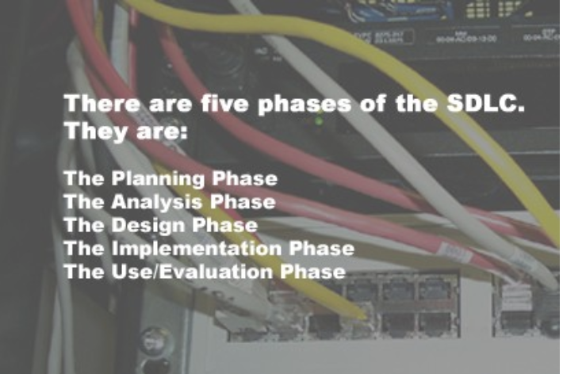

# Module 2 - Project Life Cycle

## Goals of Module
  - Describe each phase of of the Software Development Life Cycle (SDLC).
  - Identify possible constraints in a project.
  - Set project objectives.
  - List the key information areas that need to be identified and defined.
  - Identify areas of concern for users and the organisation when implementing a new system.
  - Outline how to develop the processing requirements and associated evaluation and selection.
  - List the key areas to be addressed during the implementation phase.
  - Discuss when importance of evaluation after project completion and how it feeds into maintenance and re-engineering.

## System Development Life Cycle (SDLC)
  - The most successful information technology systems are those that are able to properly solve problems within an organisation. 
  - Other names that this process is given
    - System Life Cycle
    - System Development Life Cycle
    - System Development Methodology.
  - There are 5 Phases of the SDLC
      

### 1. The Planning Phase
  - There are many reasons for changes in a business:
    - a change in government policy
    - the introduction of new, or amendment to existing, legislation
    - market trends
    - community attitudes and values
    - availability and cost of equipment
    - desire for increased competitiveness
    - employment agreements
    - health and safety.
  - Planning is important because it allows:
    - The scope of the project to be defined
    - Potential problem areas to be identified
    - The sequence of the tasks to be identified
    - The provision of a basis for control.
  - GANTT Charts can be used in this phase
  - The planning that takes places in this process is not the planning of the program or system!
    - It is the initial steps that take place to 
      - Define the project
      - Set the objectives
        - Used to evaluate the overall success of the final solution.

#### Planning Steps
  1. Recognising the problem
  2. Defining the problem
  3. Setting project objectives
  4. Identifying constraints
  5. Conducting feasibility studies
  6. Creating project proposals
  7. Establishing control mechanisms.

### 2. The Analysis Phase
  - Where existing system(s) are studied with the aims of designing a new or improved system. 
  - A number of important decisions are made including:
    - who will work on the system
    - the setting of specific performance goals for the system to achieve.
  - Data must be gathered on the strengths and weaknesses of the existing system by using methods such as:
    - observation
    - research
    - interviewing
    - sampling to trace procedural paths and information flows
  - This is where the decision on whether or not to proceed with the project must be made. 
    - This decision will be made based upon the information that is contained within the design proposal
    - It is important that the design proposal clearly identifies:
      - What resources will be required to complete the project
      - The major goals and the time frame for the completion of the project

#### Analysis Steps
  1. Announcing the project
  2. Creating the project team
  3. Defining information needs
  4. Defining system performance criteria
  5. Creating a design proposal

### 3. The Design Phase
  - Where the new system will be designed. 
  - The processes and data required by the new system are defined. 
#### Design Steps
  1. Preparing a detailed system design
  2. Identifying and evaluating alternative system configurations
  3. Selecting the best configuration
  4. Preparing an implementation proposal.

### 4. The Implementation Phase
  - Where physical and conceptual resources that are required are obtained and integrated into the existing system to produce the final working system.
#### Implementation Steps
  1. Planning and announcing the implementation
  2. Acquiring the hardware resources
  3. Acquiring the software resources
  4. Preparing the physical facilities
  5. Educating the participants and users
  6. Preparing an implementation schedule (or changeover)
  7. Changing over to the new system.

### 5. The Use/Evaluation Phase
  - By this phase, the system should be in full use to meet the objectives that were initially identified in the planning phase.
  - Data can be gathered by:
    - Recording equipment breakdowns
    - Monitoring staff absentee rates
    - Logging help desk enquiries
    - Surveying customers
    - With each of these methods take into account:
      - efficiency (time, cost, effort)
      - effectiveness (timeliness, accuracy, relevance, completeness)
      - maintainability

#### Use/Evaluation Steps
  1. Using the system
  2. Auditing the system (including a post implementation review)
  3. Maintaining the system
  4. Re-engineering proposals.